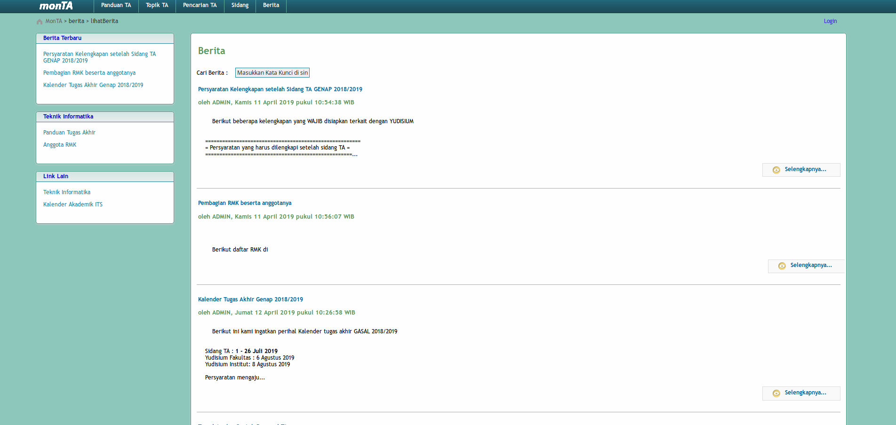
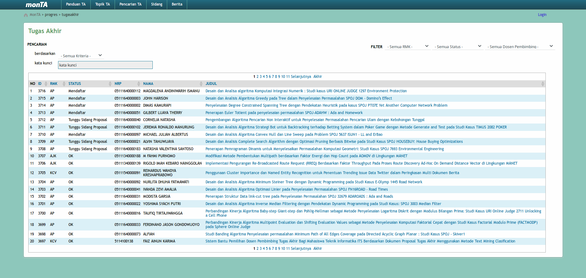

# Final Project Ichiraku Ramen

## Team Member
1. Ferdinand Jason Gondowijoyo (05111640000033)
2. Jonathan Rehuel Lewerissa (05111640000105)
3. Frandita Adhitama (05111640000129)

## Table of Content
- [Final Project Ichiraku Ramen](#final-project-ichiraku-ramen)
  - [Team Member](#team-member)
  - [Table of Content](#table-of-content)
- [Project Topic : Redesigning monTA (Monitoring Tugas Akhir)](#project-topic--redesigning-monta-monitoring-tugas-akhir)
  - [System Description](#system-description)
  - [What's Bad About The Existing System](#whats-bad-about-the-existing-system)
- [Contextual Inquiry](#contextual-inquiry)
  - [Instruction Script](#instruction-script)
  - [Participant 1](#participant-1)
    - [Participant Description](#participant-description)
    - [Transcript](#transcript)
    - [Models and Annotations](#models-and-annotations)
      - [Artifact Model](#artifact-model)
      - [Flow Model](#flow-model)
      - [Cultural Model](#cultural-model)
  - [Participant 2](#participant-2)
    - [Participant Description](#participant-description-1)
    - [Transcript](#transcript-1)
    - [Models and Annotations](#models-and-annotations-1)
      - [Artifact Model](#artifact-model-1)
      - [Flow Model](#flow-model-1)
      - [Cultural Model](#cultural-model-1)
  - [Participant 3](#participant-3)
    - [Participant Description](#participant-description-2)
    - [Transcript](#transcript-2)
    - [Models and Annotations](#models-and-annotations-2)
      - [Artifact Model](#artifact-model-2)
      - [Flow Model](#flow-model-2)
      - [Cultural Model](#cultural-model-2)
  - [Participant 4](#participant-4)
    - [Participant Description](#participant-description-3)
    - [Transcript](#transcript-3)
    - [Models and Annotations](#models-and-annotations-3)
      - [Artifact Model](#artifact-model-3)
      - [Flow Model](#flow-model-3)
      - [Cultural Model](#cultural-model-3)
  - [Participant 5](#participant-5)
    - [Participant Description](#participant-description-4)
    - [Transcript](#transcript-4)
    - [Models and Annotations](#models-and-annotations-4)
      - [Artifact Model](#artifact-model-4)
      - [Flow Model](#flow-model-4)
      - [Cultural Model](#cultural-model-4)
  - [Do's and Don't](#dos-and-dont)
    - [Do's](#dos)
    - [Dont's](#donts)
- [Prototyping - Iteration 1](#prototyping---iteration-1)
  - [Sketches](#sketches)
    - [Sketches with Invision (Low Fidelity)](#sketches-with-invision-low-fidelity)
    - [Version Differences](#version-differences)
    - [Selected Sketch](#selected-sketch)
    - [Design Rationale](#design-rationale)
  - [Asummptions](#asummptions)
    - [Hardware](#hardware)
    - [User](#user)
  - [Prototype](#prototype)

# Project Topic : Redesigning monTA (Monitoring Tugas Akhir)
## System Description

As an undergraduate in Indonesia, especially in Institut Teknologi Sepuluh Nopember Surabaya, an undergraduate is expected to complete a final assignment, or thesis, to complete their bachelor's degree. A series of steps should be conducted in order to complete this assignment, from the initial proposal of a thesis to the final thesis presentation. This series of steps, however, must be documented and monitored properly in order to properly finish the assignment.  

MonTA *(Monitoring Tugas Akhir)* is a system designed for monitoring the progress of an undergraduate's thesis. The system acts as a platform for students and lecturers to directly monitor their progress on completing their theses. The system also provides a platform for lecturers to promote their research that a student may take in order to complete their thesis.

## What's Bad About The Existing System
Our team have found some problems in the existing system. The first one is about finding information about theses in the system. The current system only provides a limited search capability that does not cover all of the needed information nowdays. The second one is the outdated user interface. The user interface, while functionally sufficient, does not provide a good experience for the users, especially for the first timers.



In this final project, our teams will look out for the main problems that causes the observations above and propose a solution that hopefully may fix the current problem.

# Contextual Inquiry
## Instruction Script
1. Try logging in to monTA with the given username
2. Find out how many Final Project with specialization "Algoritma dan Pemrograman".
3. Find out how many Final Project with specialization "Komputasi Berbasis Jaringan" and having title contains substring "Klasifikasi".
4. Find out how many Final Project having title contains substring "Aplikasi" and class of 2007
5. Find out how many Final Project with supervisor Rully Soelaiman and with specialization "Komputasi Cerdas dan Visi".
6. In what year did Hadziq Fabroyir become a supervisor ?
7. Find out the lecturer who offer Final Project Topics with title contains "Prediksi"
   
## Participant 1
### Participant Description
1. The parcipant is male student of Informatics Deparment ITS 2017.
2. The participant never open the monTA page.

### Transcript
1. Interviewer : Selamat siang, terima kasih atas waktunya bersedia untuk hadir diwawancarai. Pertama-tama pernahkah menggunakan monTA (Monitoring Tugas Akhir) yang bisa diakses pada URL : https://monta.if.its.ac.id.
2. Participant : Selamat siang juga, kalau monTA belum pernah karena emang belum waktunya.
3. Interviewer : Oke, pertama-tama bisa login di monTA dengan username dan password sebagai berikut *sensor*.
4. Participant : Oke
- **01:10** (Participant telah berhasil untuk login).
5. Interviewer : Bagaimana ?
6. Participant : Tulisan loginnya terlalu kecil, hampir tidak keliatan.
7. Interviewer : Oke untuk selanjutnya coba cari tahu berapa banyak tugas akhir dengan RMK Algoritma dan Pemrograman.
8. Participant : Sebentar.
- **3:13** (Participant memilih menyerah untuk melakukan tugasnya)
9. Participant : Udah nyerah deh, gatau navigasi halaman nya ga jalan, ga bisa pindah kehalaman berikutnya, jadinya ga tahu totalnya berapa.
10. Interviewer : Oke deh, sekarang lanjut saja ya untuk tugas berikutnya, Coba cari tahu berapa banyak Tugas Akhir dengan RMK KBJ dan memiliki judul TA mengandung string "Klasifikasi".
11. Participant : Oke, tapi kayaknya gabisa lagi deh kan Navigasi antar halamannya ga bisa.
12. Interviewer : Udah coba dulu aja gapapa
- **5:01** (Participant memilih untuk menyerah untuk melakukan tugasnya)
13. Participant : Ga bisa, navigasinya tidak jalan, sama seperti sebelumnya gabisa buat menghitung berapa. Emang rusak ya ? atau bagaimana ?
14. Interviewer : Sebenarnya bisa sih kemarin ku coba.
15. Participant : Hmmm yaudah deh.
16. Interviewer : Oke sekarang lanjut untuk tugas selanjutnya ya. Selanjutnya coba cari tahu berapa banyak Tugas Akhir dengan Judul TA mengandung string "Aplikasi" pada angkatan 2007.
17. Participant : Oke deh.
- (Navigasi page pada Participant telah berfungsi kembali)
- **11:12** (Participant telah menyelesaikan tugasnya)
18.  Participant : Susah juga, tadi sampai harus nge-find satu satu, baru ketemu. Harusnya sih bisa multiple query gitu di kotak pencariannya. Tapi anehnya juga navigasinya bisa tadi.
19.  Interviewer : Oke deh yang penting bisa. sekarang lanjut lagi ya. Sekarang coba cari tahu berapa banyak Tugas Akhir dengan RMK KCV dengan dosen pembimbing Pak Rully.
20.  Participant : Oke deh.
- **13:30** (Participant telah menyelesaikan tugasnya)
21.  Participant : Sudah..
22.  Interviewer : Wah makin cepat, sekarang lanjut ya, Selanjutnya adalah cari tahu pada tahun berapa saja Pak Hadziq menjadi dosen pembimbing.
23.  Participant : Oke.
- **16:01** (Participant telah menyelesaikan tugasnya)
24.  Participant : Oke, selanjutnya suruh ngapain ?
25.  Interviewer : Selanjutnya coba cari tahu dosen yang menawarkan topik TA dengan judul yang mengandung string "Prediksi"
26.  Participant : Sebentar.
- **18:03** (Participant telah menyelesaikan tugasnya)
27.  Participant : Sudah.
28.  Interviewer : Oke, bagaimana ada tanggapan ?
29.  Participant : Penempatan KBK / RMK kurang konsisten, kemudian judulnya saya tidak tahu kalau itu bisa diklik, sementara tulisan selengkapnya hampir tidak terlihat.
30.  Interviewer : Oke sip, sekarang apakah ada tanggapan terkait keseluruhan website monTA ini ?
31.  Participant : Ya sebagian sudah tadi sih sebelumnya, kalau mau nambah ya beberapa field input itu saya kira malah tombol yang bisa diklik, sama websitenya secara keseluruhan tidak intuitif untuk digunakan.
32.  Interviewer : Oke oke. Terima kasih atas waktunya ya.
33.  Participant : Oke.


### Models and Annotations
#### Artifact Model

#### Flow Model

#### Cultural Model


## Participant 2
### Participant Description
1. The parcipant is male student of Informatics Deparment ITS 2017.
2. The participant never open the monTA page.
   
### Transcript
1. Interviewer : Selamat siang, terima kasih atas waktunya bersedia untuk hadir diwawancarai. Pertama-tama pernahkah menggunakan monTA (Monitoring Tugas Akhir) yang bisa diakses pada URL : https://monta.if.its.ac.id.
2. Participant : Belum pernah kalau buka monTA, bahkan baru tahu saya.
3. Interviewer : Oke, pertama-tama bisa login di monTA dengan username dan password sebagai berikut *sensor*.
4. Participant : Oke
- **01:09** (Participant telah berhasil untuk login).
5. Interviewer : Oke, setelah login sekarang  coba cari tahu berapa banyak tugas akhir dengan RMK Algoritma dan Pemrograman.
6. Participant : Oke, tapi yang tadi itu sebenernya ngira ngira sih kalau itu buat login.
- **02:18** (Participant telah berhasil melakukan tugasnya)
7. Participant : Sudah
8. Interviewer : Oke, bagaimana menurutmu ?
9. Participant : Sebenernya agak bingung sih, karena navigasinya agak gimana gitu, saran sih gunain simbol jangan pakai kalimat gitu, refleknya beda gitu.
10. Interviewer : Oke deh, sekarang lanjut saja ya untuk tugas berikutnya, Coba cari tahu berapa banyak Tugas Akhir dengan RMK KBJ dan memiliki judul TA mengandung string "Klasifikasi".
11. Participant : Oke
- **4:20** (Participant telah menyelesaikan tugasnya)
12. Participant : Oke sudah
13. Interviewer : Oke bagaimana menurutmu ?
14. Participant : Ya masih sama sih, susah untuk dinavigasi antar halamannya
15. Interviewer : Oke sekarang lanjut untuk tugas selanjutnya ya. Selanjutnya coba cari tahu berapa banyak Tugas Akhir dengan Judul TA mengandung string "Aplikasi" pada angkatan 2007.
16. Participant : Siap.
- **10:13** (Participant telah menyelesaikan tugasnya)
17.  Participant : Tadi aku sempat bingung, karena aku kira masukkan kata kunci itu bisa mencari semua kategori ternyata gabisa, harus memilih. Dan akhirnya nge-find 1 1 pake CTRL + F.
18.  Interviewer : Oke deh yang penting bisa. sekarang lanjut lagi ya. Sekarang coba cari tahu berapa banyak Tugas Akhir dengan RMK KCV dengan dosen pembimbing Pak Rully.
19.  Participant : Siap.
- **13:46** (Participant telah menyelesaikan tugasnya)
20.   Participant : Sudah..
21.   Interviewer : Wah makin cepat, sekarang lanjut ya, Selanjutnya adalah cari tahu pada tahun berapa saja Pak Hadziq menjadi dosen pembimbing.
22.   Participant : Siap.
- **16:23** (Participant telah menyelesaikan tugasnya)
23.   Participant : Sudah.
24.   Interviewer : Selanjutnya coba cari tahu dosen yang menawarkan topik TA dengan judul yang mengandung string "Prediksi"
25.   Participant : Hmm.
- **18:03** (Participant telah menyelesaikan tugasnya)
26.    Interviewer : Oke, bagaimana tadi ?
27.   Participant : Ada error disistemnya tadi, bingung, saya yang salah atau emang error sistemnya, tapi jalan sih. Kemudian bingung juga tentang UI nya.
28.   Interviewer : Oke sip, sekarang apakah ada tanggapan terkait keseluruhan website monTA ini ?
29.   Participant : Sudah semuanya sih.
30.   Interviewer : Oke oke. Terima kasih atas waktunya ya.
31.   Participant : Oke.

### Models and Annotations
#### Artifact Model

#### Flow Model

#### Cultural Model


## Participant 3
### Participant Description
1. The parcipant is male student of Informatics Deparment ITS 2017.
2. The participant never open the monTA page.

### Transcript
1. Interviewer : Selamat siang, terima kasih atas waktunya bersedia untuk hadir diwawancarai. Pertama-tama pernahkah menggunakan monTA (Monitoring Tugas Akhir) yang bisa diakses pada URL : https://monta.if.its.ac.id.
2. Participant : Belum sih.
3. Interviewer : Oke, pertama-tama bisa login di monTA dengan username dan password sebagai berikut *sensor*.
4. Participant : Oke
- **01:32** (Participant telah berhasil untuk login).
5. Interviewer : Bagaimana menurutmu ?
6. Participant : Tadikan sempat salah, dan tidak ada notifikasi bahwa password/username yang diberikan salah
7. Interviewer : Oke, lanjut ya, sekarang coba cari tahu berapa banyak tugas akhir dengan RMK Algoritma dan Pemrograman.
8. Participant : Oke.
- **03:13** (Participant telah berhasil melakukan tugasnya)
9. Participant : Sudah
10. Interviewer : Oke, bagaimana menurutmu ?
11. Participant : Pertama tama bingung sih, antara topik TA dan pencarian TA dimana bedanya. kemudian tadi gabisa buat navigasi. tapi setelah ganti browser dan reload bisa terus ya gitu.
12. Interviewer : Oke deh, lanjut untuk tugas berikutnya ya, Coba cari tahu berapa banyak Tugas Akhir dengan RMK KBJ dan memiliki judul TA mengandung string "Klasifikasi".
13. Participant : Oke
- **05:36** (Participant telah menyelesaikan tugasnya)
13. Participant : Oke sudah
14. Interviewer : Oke bagaimana menurutmu ?
15. Participant : Saya kira tadi judul itu sempat tidak bisa diklik tapi ternyata bisa,
16. Interviewer : Sip, sekarang lanjut. Coba cari tahu berapa banyak Tugas Akhir dengan Judul TA mengandung string "Aplikasi" pada angkatan 2007.
17. Participant : Oke.
- **10:35** (Participant telah menyelesaikan tugasnya)
18. Participant : Pake CTRL + F sih tadi, karena ga bisa multiple query dalam dropdown pada kategori, jadinya agak curang.
19. Interviewer : Oke deh yang penting bisa. sekarang lanjut lagi ya. Sekarang coba cari tahu berapa banyak Tugas Akhir dengan RMK KCV dengan dosen pembimbing Pak Rully.
20. Participant : Oke.
- **14:01** (Participant telah menyelesaikan tugasnya)
21. Participant : Sudah..
22. Interviewer : Wah sip, Selanjutnya adalah cari tahu pada tahun berapa saja Pak Hadziq menjadi dosen pembimbing.
23. Participant : Oke.
- **15:40** (Participant telah menyelesaikan tugasnya)
24. Participant : Sudah.
25. Interviewer : Selanjutnya coba cari tahu dosen yang menawarkan topik TA dengan judul yang mengandung string "Prediksi"
26. Participant : Oke.
- **16:56** (Participant telah menyelesaikan tugasnya)
27.  Interviewer : Oke, bagaimana ?
28.  Participant : Bingung sih, tadi sempat kukira error ternyata kesalahan sistem. Kemudian tulisan DTK tidak pada tempatnya. Dan judulnya itu ambigu bisa diklik atau engga.
29.  Interviewer : Oke sip, ada tambahan secara keseluruhan ?
30.  Participant : Tidak ada
31.  Interviewer : Oke, Terima kasih atas waktunya ya.
32.  Participant : Oke.

### Models and Annotations
#### Artifact Model

#### Flow Model

#### Cultural Model


## Participant 4
### Participant Description
1. The parcipant is male student of Informatics Deparment ITS 2016.
2. The participant never open the monTA page.
   
### Transcript
1. Interviewer : Selamat siang, terima kasih atas waktunya bersedia untuk hadir diwawancarai. Pertama-tama pernahkah menggunakan monTA (Monitoring Tugas Akhir) yang bisa diakses pada URL : https://monta.if.its.ac.id.
2. Participant : Belum karena ga ambil Pra-TA
3. Interviewer : Oke, pertama-tama bisa login di monTA dengan username dan password sebagai berikut *sensor*.
4. Participant : Oke
- **01:32** (Participant telah berhasil untuk login).
5. Interviewer : Bagaimana menurutmu ?
6. Participant : Jelek pokoknya, ga kayak web lain sama kaya monkp juga, dan ga ada notifikasinya kalau salah login.
7. Interviewer : Oke siap, sekarang coba cari tahu berapa banyak tugas akhir dengan RMK Algoritma dan Pemrograman.
- **02:30** (Participant telah berhasil melakukan tugasnya)
8. Participant : Sudah
9. Interviewer : Oke, bagaimana menurutmu ?
10. Participant : Belum ada sih,
11. Interviewer : Oke deh, lanjut, coba cari tahu berapa banyak Tugas Akhir dengan RMK KBJ dan memiliki judul TA mengandung string "Klasifikasi".
12. Participant : Oke
- **04:13** (Participant telah menyelesaikan tugasnya)
13. Participant : Oke sudah
14. Interviewer : Oke bagaimana menurutmu ?
15. Participant : Belum ada,
16. Interviewer : Oke, sekarang lanjut. Coba cari tahu berapa banyak Tugas Akhir dengan Judul TA mengandung string "Aplikasi" pada angkatan 2007.
17. Participant : Oke.
- **09:13** (Participant telah menyelesaikan tugasnya)
18.  Participant : Search nya tidak jelas, bikin emosi beneran, udah formnya tidak auto clean, kata kuncinya ga bisa bayak kategori juga, jadinya emosi.
19.  Interviewer : Oke, sabar ya. Sekarang coba cari tahu berapa banyak Tugas Akhir dengan RMK KCV dengan dosen pembimbing Pak Rully.
20.  Participant : Oke.
- **13:23** (Participant telah menyelesaikan tugasnya)
21.  Participant : Sudah..
22. Interviewer : Sip, selanjutnya adalah cari tahu pada tahun berapa saja Pak Hadziq menjadi dosen pembimbing.
23. Participant : Oke.
- **14:30** (Participant telah menyelesaikan tugasnya)
24. Participant : Sampun.
25. Interviewer : Selanjutnya coba cari tahu dosen yang menawarkan topik TA dengan judul yang mengandung string "Prediksi"
26. Participant : Oke.
- **16:34** (Participant telah menyelesaikan tugasnya)
27.  Interviewer : Oke, bagaimana ?
28.  Participant : Kalau bisa oleh <...> itu langsung dosennya, supaya jelas, kalau tidak kasih Contact Infonya secara langsung, sama ada kodingan keluar.
29.  Interviewer : Oke sip, ada tambahan secara keseluruhan ?
30.  Participant : Tidak ada
31.  Interviewer : Oke, Terima kasih atas waktunya ya.
32.  Participant : Oke.

### Models and Annotations
#### Artifact Model

#### Flow Model

#### Cultural Model


## Participant 5
### Participant Description
1. The parcipant is male student of Informatics Deparment ITS 2016.
2. The participant never open the monTA page.
   
### Transcript
1. Interviewer : Selamat siang, terima kasih atas waktunya bersedia untuk hadir diwawancarai. Pertama-tama pernahkah menggunakan monTA (Monitoring Tugas Akhir) yang bisa diakses pada URL : https://monta.if.its.ac.id.
2. Participant : Belum
3. Interviewer : Oke, pertama-tama bisa login di monTA dengan username dan password sebagai berikut *sensor*.
4. Participant : Oke
- **01:29** (Participant telah berhasil untuk login).
5. Interviewer : Bagaimana menurutmu ?
6. Participant : Tidak ada notifikasi kalau salah login, terus juga tidak ada notifikasi format username yang digunakan.
7. Interviewer : Oke siap, sekarang coba cari tahu berapa banyak tugas akhir dengan RMK Algoritma dan Pemrograman.
- **02:30** (Participant telah berhasil melakukan tugasnya)
8. Participant : Sudah
9. Interviewer : Oke, bagaimana menurutmu ?
10. Participant : Harus navigasi ke halaman terakhir untuk tahu berapa totalnya, tidak ada tulisan jelas yang biasanya dibawah tabel gitu.
11. Interviewer : Oke deh, lanjut, coba cari tahu berapa banyak Tugas Akhir dengan RMK KBJ dan memiliki judul TA mengandung string "Klasifikasi".
12. Participant : Oke
- **04:20** (Participant telah menyelesaikan tugasnya)
13. Participant : Oke sudah
14. Interviewer : Oke bagaimana menurutmu ?
15. Participant : Membingungkan terlihat dari cara searchnya, searchnya harus secara urut (Memasukkan kata kunci terlebih dahulu baru filter), tetapi terkadang saya secara intuitif klik filter dulu.
16. Interviewer : Oke, sekarang lanjut. Coba cari tahu berapa banyak Tugas Akhir dengan Judul TA mengandung string "Aplikasi" pada angkatan 2007.
17. Participant : Oke.
- **13:23** (Participant telah menyelesaikan tugasnya)
18. Participant : Banyak nih, pertama fitur sort tidak berjalan dengan baik, kemudian pencarian tidak jelas, tidak ada fitur showall ataupun jumlah hasil sama sebelumnya. Dan kesusahan kalau ingin banyak pencarian pada dropdown, ya sama kayak tadi. Jadinya manual CTRL + F.
19. Interviewer : Oke yang penting bisa. Sekarang coba cari tahu berapa banyak Tugas Akhir dengan RMK KCV dengan dosen pembimbing Pak Rully.
20. Participant : Oke.
- **15:21** (Participant telah menyelesaikan tugasnya)
21. Participant : Tadi navigasinya langsung mengekspand gitu. Aneh jadinya
22. Interviewer : Sip, selanjutnya adalah cari tahu pada tahun berapa saja Pak Hadziq menjadi dosen pembimbing.
23. Participant : Oke.
- **16:33** (Participant telah menyelesaikan tugasnya)
24. Participant : Sudah.
25. Interviewer : Selanjutnya coba cari tahu dosen yang menawarkan topik TA dengan judul yang mengandung string "Prediksi"
26. Participant : Oke.
- **18:40** (Participant telah menyelesaikan tugasnya)
27.  Interviewer : Oke, bagaimana ?
28.  Participant : Jelek banget, ada error juga diatas, tulisan DTK nya tidak pada tempatnya, Judulnya keliatan tidak bisa diklik, trus tulisan selengkapnya nyaris tidak kelihatan.
29.  Interviewer : Oke sip, ada tambahan secara keseluruhan ?
30.  Participant : Sudah semua kayake.
31.  Interviewer : Oke, Terima kasih atas waktunya ya.
32.  Participant : Oke.

### Models and Annotations
#### Artifact Model

#### Flow Model

#### Cultural Model


## Do's and Don't

### Do's
- Give feedback on user action.
- Use consistent UI placement.
- Give user more flexibility on searching.
- Use UI that users can intuitively guess functionality.

### Dont's
- Display sistem error or something similar.
- Use unstable UI (sometimes work and sometimes error).

# Prototyping - Iteration 1
## Sketches
In this section, we are going to make **2** sketches with Invision App.

### Sketches with Invision (Low Fidelity)
- Sketches 1 (Low Fidelity - 1)


- Sketches 2 (Low Fidelity - 2)


### Version Differences
- Sketches 1 :
  In solution 1, we redesigned from the start of MonTA. Starting from the placement of input search, placing filters, columns in tables, and others.
- Sketches 2 :
  In solution 2, we redesigned UI placement on the old MonTA website for the better.

### Selected Sketch
We prefer solution 1 as the selected sketch. Because simple is the best, easy to be implemented, eye catching, intuitive, and informative.

### Design Rationale
The main problem with the original website is limited search capability, sometimes can make someone angry for using it. So we try to provides better search capability.

## Asummptions
### Hardware 
1. Screen size : 15.6 inch
2. Screen resolution : higher that on equal to 1377 x 768 with ration 4:3 with color space RGB.
3. Computer with minimum requirement :
- Intel Dual-Core
- Intel HD Graphic
- 2 GB RAM
4. Using physical buttons (mouse / keyboard) or touch screen
5. Installed new version of browser

### User
1. Familiar using web browser
2. User have medium-high experience on it.
3. User age range from 17 - 50 years old.
4. Student of Informatics Department

## Prototype
This prototype build based on `react`, in order to make this prototype work well please type this on terminal
```bash
sudo npm install -g serve
serve -s monta-prototype-1
```
After that visit : `http://localhost:5000` for demonstration.
Source of this prototype can be found in this [link](monta-prototype-1/)